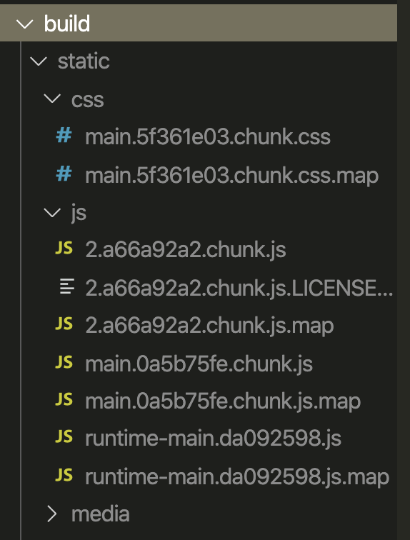
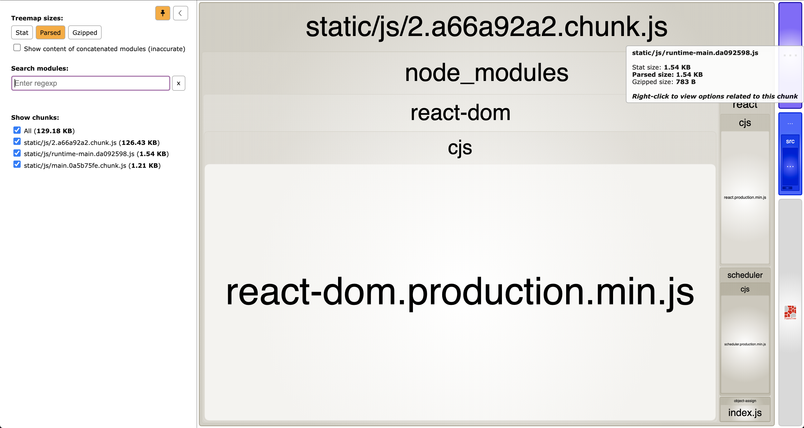
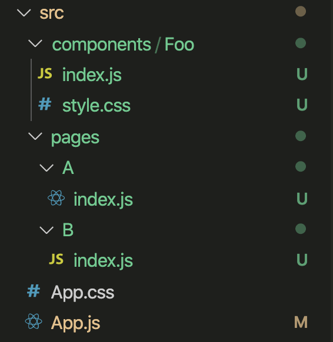
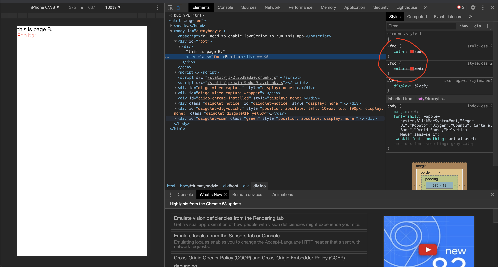

# 关于webpack的splitChunks配置项的分析

**背景**：之前开发过一个使用了 React lazy/Suspense 的项目，目的是为了在项目内页面比较多的情况下，减少访问单个页面时需要加载的文件体积，也就是常说的——**懒加载**。

**现象**：但是发现访问过多个页面后，不同页面都用到的组件样式有被重复加载的现象。

**原因**：这是因为经过webpack打包后，每个页面都会对应一个 async chunk，某组件被不同的页面引用的情况下，会分别被这些 async chunk 合并进去，这就导致同一个组件模块被打包后出现多份。

这可以通过合理配置 splitChunks 来解决。不过，不解决也并不会对项目造成影响，可能只是会牺牲一点点不必要的运算和性能。这不是本文的讨论范围，本文主要是来分析理解下 splitChunks 的作用。

下面使用 create react app 生成项目来模拟上述项目情况，和分析 splitChunks 的作用。

## 准备工作

使用 cra（create react app） 工具生成 react 项目，并运行 npm run eject 将打包配置弹出。

```
npx create-react-app splitchunks-demo
cd splitchunks-demo
npm run eject
```

可以再执行 `npm start` 确认下项目是否能正常启动运行。

### [Webpack Bundle Analyzer](https://www.npmjs.com/package/webpack-bundle-analyzer)

使用该工具分析打包输出的文件拆分情况和体积，参考官方文档配置

执行 `npm run build` 之后，构建出来的文件如下图



使用 Webpack Bundle Analyzer 查看它们内部包含的模块如下图



可以看到，输出了3个 js 文件，这和文件 `config/webpack.config.js` 里的如下配置有关

```js
splitChunks: {
  chunks: 'all',
  name: false,
},
runtimeChunk: {
  name: entrypoint => `runtime-${entrypoint.name}`,
},
```

## 配置分析

上面的 `splitChunks.chunks` 用来指定哪类 chunks 需要做拆包优化，包括三个值

- async ，表示异步的 chunks，即通过 import() 异步载入的模块生成的 chunks
- initial ，与 async 相对，表示初始载入的 chunks，即非异步方式载入的 chunks
- all ，表示全部的 chunks

仔细看下之前生成的打包分析图，我们看到

- 2.a66a92a2.chunk.js 内都是 node_modules 下的模块
- runtime-main.da092598.js 则是 webpack 的 runtime
- main.0a5b75fe.chunk 则是处理 `src/index.js` 得到的主入口文件

其中 2.a66a92a2.chunk.js 和 runtime-main.da092598.js 就是拆分出的 chunk

`runtime-main.da092598.js` 容易理解，是由上面的 runtimeChunk 项配置决定的

那为什么 node_modules 下的模块都被提取到了 `2.a66a92a2.chunk.js` 了呢？

查阅官方文档

[SplitChunksPlugin](https://webpack.js.org/plugins/split-chunks-plugin/)

可以看到 splitChuncks 的默认配置如下

```js
splitChunks: {
  chunks: 'async',
  minSize: 30000,
  minRemainingSize: 0,
  maxSize: 0,
  minChunks: 1,
  maxAsyncRequests: 6,
  maxInitialRequests: 4,
  automaticNameDelimiter: '~',
  cacheGroups: {
    defaultVendors: {
      test: /[\\/]node_modules[\\/]/,
      priority: -10
    },
    default: {
      minChunks: 2,
      priority: -20,
      reuseExistingChunk: true
    }
  }
}
```

可以看到是由 defaultVendors 这块配置决定的。

通过查阅相关资料和文档，可以了解到 cacheGroups 对 chunks 的拆分起着关键的作用。可以通过 cacheGroups 来定制 chunks 拆分策略。

现在回到文章开始说的模块重复加载的问题，它是怎么造成的？

## 模拟问题

现在修改下原本的项目，添加如下图文件



其中 A，B 两页面都引用了同一个组件 Foo，并且都使用 React.lazy 加载，如下：

```js
const A = lazy(() => import('./pages/A'));
const B = lazy(() => import('./pages/B'));

function App() {
  return (
    <HashRouter>
      <Suspense fallback="">
        <Switch>
          <Route exact path="/" component={A}></Route>
          <Route exact path="/b" component={B}></Route>
        </Switch>
      </Suspense>
    </HashRouter>
  );
}
```

然后执行 `npm run build` 构建，这次会多出两个异步 chunks，对应 A，B 这两个页面。

当从 A 页面跳转到 B 页面后，会发现 B 页面的，Foo 的组件样式载入了两遍，结果如下图：



检查发现，A、B页面对应的两个 chunks 文件内，都有 Foo 组件的内容，build/static/css 目录下也有两个内容一样的 css 文件。

## 解决问题

我们回过头去看 splitChunks 的默认配置，cacheGroups 下，还有这样一个提取策略

```js
default: {
  minChunks: 2,
  priority: -20,
  reuseExistingChunk: true
}
```

它的意思是，被引用次数超过两次的 js 模块（ `minChunks: 2` ），需要提取到同一个新的 chunk，可实际上并没有输出这样的 chunk。我们再看这一行

```js
minSize: 30000,
```

它的意思是，只有模块的文件体积超过 30000 byte，即 30 kb，才有必要提取出去。所以原因就在这了。

于是我们把它修改掉试试，最后 webpack.config.js 中的 splitChunks 配置如下：

```js
splitChunks: {
  chunks: 'all',
  name: false,
  minSize: 0
},
runtimeChunk: {
  name: entrypoint => `runtime-${entrypoint.name}`,
},
```

再执行一遍 `npm run build`，现在我们再去审查 Foo 组件，就不会再有前面重复加载的问题了。

## 最佳实践

现在是不是对定制 splitChunks ，会有一些思路了？但是怎样制定 splitChunks 策略最好，通常是要结合自己碰到的业务需求来确定的，这个就有待大家探索了。

我认为使用 splitChunks 的目的，就是想要

1. 减小包的体积（也是为了服务于第2点）
2. 减少页面的加载时间（内容相对固定的一些模块放到同一个chunks，就可以充分利用浏览器的缓存功能）

所以通常，我们会进行以下实践

1. 厂商模块（通常是业务依赖的node_modules下的一些作为基础的模块）可提取到一个名为 vendors 的文件中，它们基本不大会需要改动。
2. 不同业务项目依赖的公共模块（比如组件库，工具库之类这些改动不是很频繁的模块），可提取到一个名为 common 的文件中。

剩下的就交给 webpack 的默认配置去完成就好啦~

## 相关文章

[webpack 4 Code Splitting 的 splitChunks 配置探索](https://imweb.io/topic/5b66dd601402769b60847149)
